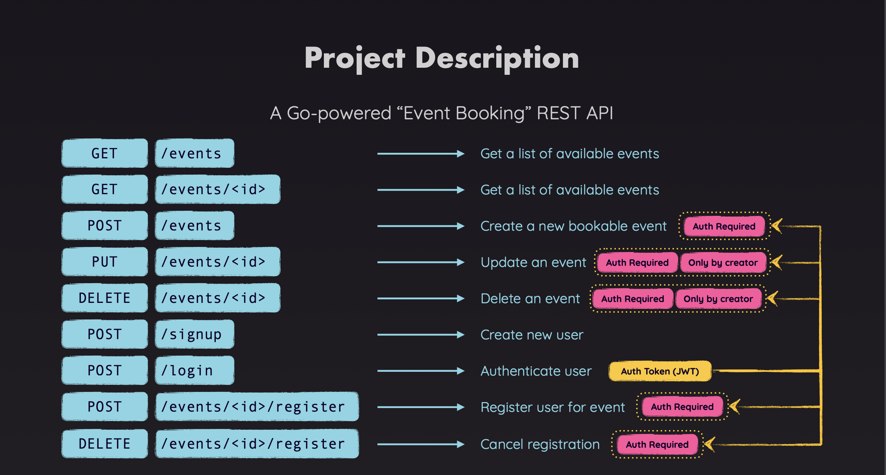

# Event Booking REST API

This project is a Go-powered REST API for managing event bookings. It allows users to create, update, delete, and view events, as well as manage user registrations for these events.

## Project Description



The Event Booking API provides the following endpoints:

### Event Endpoints

- **GET /events**
  - Description: Get a list of available events.
  - Authentication: Not required.

- **GET /events/{id}**
  - Description: Get details of a specific event by ID.
  - Authentication: Not required.

- **POST /events**
  - Description: Create a new bookable event.
  - Authentication: Required.
  - Authorization: Only authenticated users can create events.

- **PUT /events/{id}**
  - Description: Update an event.
  - Authentication: Required.
  - Authorization: Only the creator of the event can update it.

- **DELETE /events/{id}**
  - Description: Delete an event.
  - Authentication: Required.
  - Authorization: Only the creator of the event can delete it.

### User Endpoints

- **POST /signup**
  - Description: Register a new user.
  - Authentication: Not required.

- **POST /login**
  - Description: Authenticate a user and receive a JWT token.
  - Authentication: Not required.

### Registration Endpoints

- **POST /events/{id}/register**
  - Description: Register a user for an event.
  - Authentication: Required.

- **DELETE /events/{id}/register**
  - Description: Cancel a registration for an event.
  - Authentication: Required.

## Authentication

The API uses JWT (JSON Web Tokens) for authentication. After signing up, users can log in to receive a JWT, which must be included in the `Authorization` header for all requests that require authentication.

## Authorization

Certain actions, such as updating or deleting an event, are restricted to the user who created the event. This is enforced through the API's authorization mechanisms.

## Installation

1. Clone the repository:
    ```bash
    git clone https://github.com/Alextz307/go-rest-api.git
    ```
2. Navigate to the project directory:
    ```bash
    cd go-rest-api
    ```
3. Install dependencies:
    ```bash
    go mod tidy
    ```
4. Run the application:
    ```bash
    go run main.go
    ```

## Usage

To use the API, you'll need to send HTTP requests to the corresponding endpoints. You can use tools like `curl`, Postman, or any HTTP client of your choice.

Example: 

1. Registering a new user
   
```bash
curl -X POST http://localhost:8080/signup -d '{"username":"user1","password":"pass123"}'
```

2. Creating a new event (Authentication required)

```bash
curl -X POST http://localhost:8080/events -H "Authorization: Bearer YOUR_JWT_TOKEN" -d '{"name":"Event 1","date":"2024-08-20"}'
```
